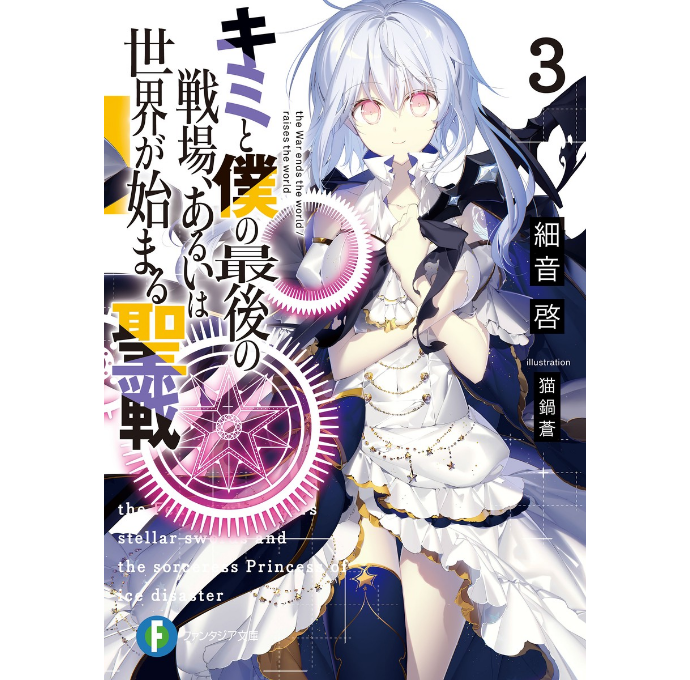
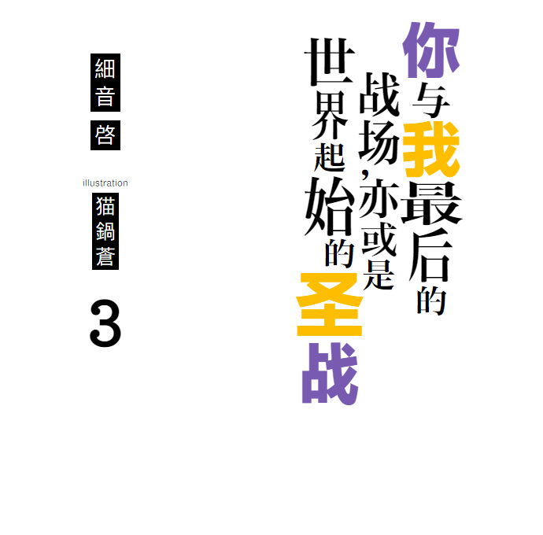
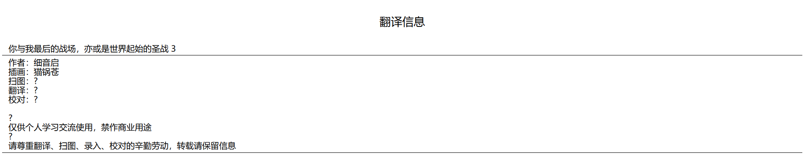
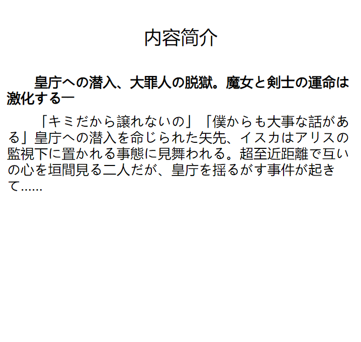
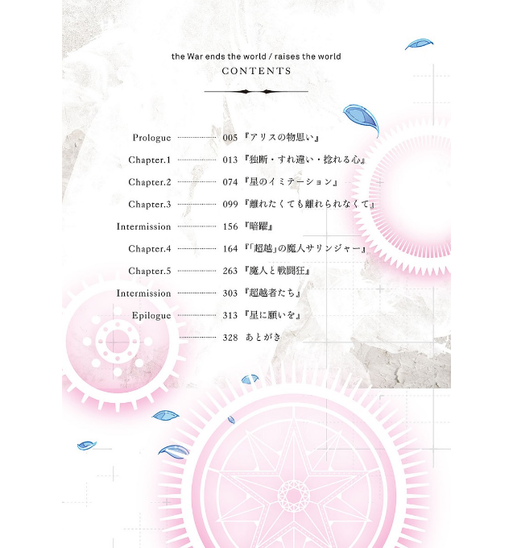
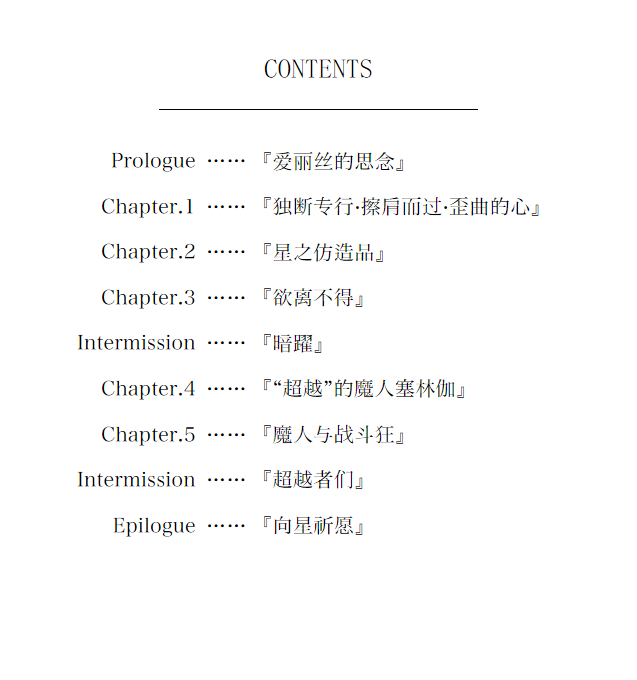
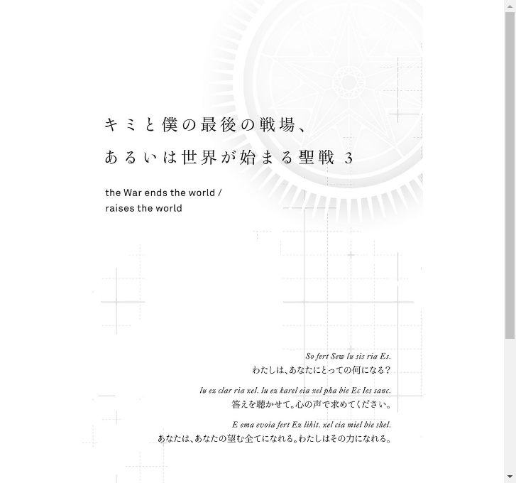
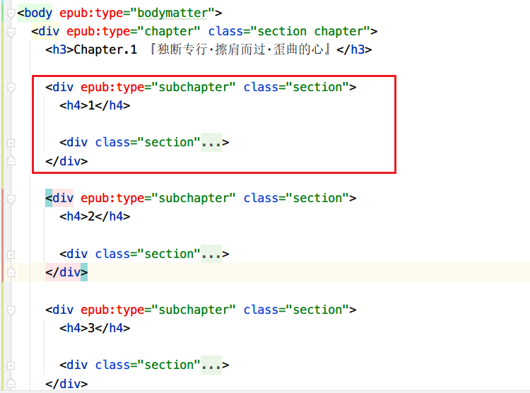
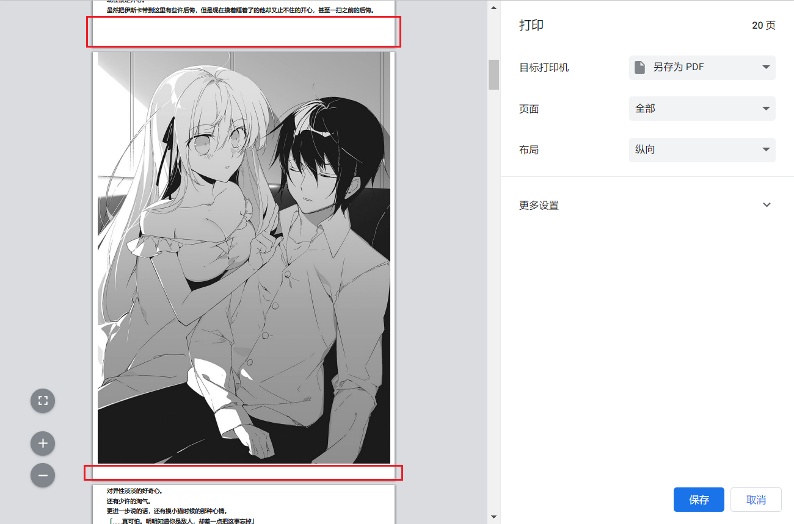

# goal

## 前言

epub精美排版正在逐步消失。主要原因之一是制作流程过于繁杂；而且存在一定的技术门槛，对前端技术尤其是CSS要求较高。

从这方面来看，和静止系MAD的逐步消失的原因有很大的相似性。

为了减缓epub精美排版逐渐消失的困境，这里希望能找到一种解决方案，它能够：

- 降低制作精美epub的技术门槛。

  这里主要思路是**建立一套渐进式、具有普适性的排版美化CSS工具库**。一旦熟悉上手，就能通过添加简单的标签或者css类来快速达到美化的效果。

  如果对这个CSS预处理美化方案不满意，那么**应该给出一套自定义CSS工具库的教程/方法论**，帮助epub制作者来达到个性化主题的目的。这里可以考虑使用css预处理器，例如Sass、Less等，或者TailwindCSS这类较为底层灵活的框架来完成。

- 提高制作精美epub的产出效率。

  传统方式是：先对文本预处理，正则表达式清洗、分段落，然后导入epub编辑器，例如Sigil中进行编辑。

  这一步，可以考虑**使用脚本，例如python、rust、node脚本来自动化处理，极速生成epub内容初稿**。

  ---

  而最为关键的排版美化步骤，依旧需要人工手动对特定文本来应用CSS类，并仔细微调，才能达到满意的效果。

  目前，Sigil对代码几乎没有Intellisense智能感知提示，UI交互方面效率也一般。

  - [x] 坚持在Sigil中编写CSS类，没有CSS提示，也不是不能用。

  - [ ] ~~编写用于Sigil 的CSS代码提示插件。~~
  - [x] 在其他编辑器中进行代码美化预演，完成后复制到Sigil。
  - [ ] ~~开发类似Sigil的epub编辑器，使用现代先进的lsp协议，兼容任何编程语言。可以参阅 vs code的架构。~~

本文中，主要聚焦第一点：降低制作精美epub的技术门槛。。第二点不在本文深入讨论的范围。


## 目标产出

- [ ] lightnovel-css library
- [ ] lightnovel genertate API
- [ ] font minify solution


## lightnovel-css

分析《你我战》所有精排epub的CSS源码，抽取设计思想，提炼出一套适用于现代轻小说的CSS排版方案。

目前主要focus这些方面：

### 封面页



> cover.xhtml
```html
<body epub:type="cover">
  <div epub:type="cover" class="section cover">
    <div epub:type="figure" class="illus duokan-image-single">
      
    </div>
  </div>
</body>
```
涉及2种epub类型：cover和figure。主要目标是封面图片水平居中，高度撑满视口(100vh)。

CSS关联样式分析：

```css
/*@ Format - section */
body > .section { duokan-bleed: leftright; overflow: visible; margin: 0 auto; width: 100%; }
```

对于body的直接子元素.section，**容器宽度100%，水平居中**。符合页面居中排版的习惯。

```css
.cover{
	margin: 0em;
	padding: 0em;
	text-indent: 0em;
	text-align: center;
}
```

.cover 容器去掉了内外边距，并设置子元素为水平居中。这是考虑到它的子元素很可能是一个img行内元素，因此才设置text-align:center.

```css
/*@ Components - illus */
.illus/*# [epub|type=figure] */ 
{   text-indent: 0; 
    text-align: center !important;
    width: 100%;
    height: 100vh; 
    page-break-inside: avoid;
    break-inside: avoid;
    display: -webkit-flex; 
    display: flex; 
    -webkit-align-items: center;
    align-items: center;
    -webkit-justify-content: center;
    justify-content: center;
}

.illus > */*# [epub|type=figure] > * */ 
{ margin: auto; }
```

这里关键还是使用text-align设置子元素水平居中。以及设置了 page-break-inside和break-inside来保证分页时避免拆开插图。

可以查阅该链接 [break-inside属性](https://developer.mozilla.org/en-US/docs/Web/CSS/break-inside) 。此外，使用flex弹性盒模型设置子元素绝对居中。

最后的一个 css class：duokan-image-single 可以忽略，这是多看阅读器特定的排版样式，没有普适性。为避免语言赘述，下文中不再刻意提醒对多看阅读器独占样式的忽略。

代码迁移策略：代码不多，可以直接迁移。


### 标题页



> title_page.xhtml

```html
<body epub:type="frontmatter">
<div epub:type="titlepage" class="section title_page">
    <div class="page-med">
        <div class="pa-5p">
            <h1 epub:type="covertitle" class="void">你与我最后的战场，亦或是世界起始的圣战 3</h1>

            <div class="h1 line-hvc w-4e right">【右侧3列】</div>

            <div class="w-2e5 line-hvc">【左侧1列】</div>

            <div class="clear"></div>
        </div>
    </div>
</div>
</body>
```

epub类型分析：frontmatter是前言，titlepage为标题页，covertitle为封面标题。

- .section这里依旧采用了类似上面的样式，而.title_page为语义化标识，暂时没有实际的样式。
- .page-med对页面宽度做了限制，这里是20em，margin设置auto。保证水平居中。
- .pa-5p这里容器再次设置了内部padding，`.pa-5p { padding: 5%; }`。这种命名方式类似于tailwindcss的短命名理念。
- 继续里面的子元素，就是真正的内容了。

从整体看来，这是一个竖直文字排版的例子。一共有4列。右侧3列为标题，左侧一列为作者和插画师署名。

- h1的 class="void" 这个样式会隐藏这个元素一切内容的显示。

- 末尾 .clear div是清除浮动。

- 中间两个div元素很多，详细请参阅源码。这里简述部分CSS类的含义。
  - h1 line-hvc w-4e right：分别表示一级标题；line-height为1，width和height为1px，text-align：center；width：4em；right表示右浮动。


### 制作信息页01-贡献者

> information-01.xhtml



```css
<body epub:type="frontmatter">
<div epub:type="contributors" class="section information">
    <h3>翻译信息</h3>

    <div class="section infobox">
        ...
    </div>
</div>
</body>
```

epub类型有：epub:type="frontmatter"表示前言；epub:type="contributors"表示贡献者；

.section 已经介绍过。.information类为语言标识，可以按需添加自定义CSS样式。

infobox中：

```html
<div class="section infobox">
    <p>你与我最后的战场，亦或是世界起始的圣战 3</p>
    <p class="top">作者：细音启</p>
    <p>插画：猫锅苍</p>
    <p>扫图：?</p>
    <p>翻译：?</p>
    <p>校对：?</p>
    <p><br/></p>
    <p>?</p>
    <p>仅供个人学习交流使用，禁作商业用途</p>
    <p>?</p>
    <p class="bottom">请尊重翻译、扫图、录入、校对的辛勤劳动，转载请保留信息</p>
</div>
```

infobox主要设置了margin边距，里面的.top和.bottom分别单独设置上边距和下边距。


### 制作信息页02-版权说明

> information-02.xhtml

```html
<body epub:type="frontmatter">
  <div epub:type="imprint" class="section information">
    <div class="page-full">
      <div class="classic">
        <p class="team">团队名称</p>

        <div class="logo">
          
        </div>

        <div class="contributer maker">
          <p class="item">制<br/>作</p>

          <p class="name">制作人</p>
        </div>
      </div>
    </div>
  </div>
</body>
```

epub类型：imprint表示版权说明。

```css
.information .classic {
    width: 30em;
    padding: 5%;
    margin: 10% auto;
}
```

.classic设置了固定的宽度，以及合理的内外边距。

contributer maker：表示贡献者，制作人。这里的CSS样式在最新的chrome中得到了错乱的显示效果。应该重新设计CSS布局。

> 制作两字格式错乱原因，在于chrome不接受低于12px的字号。该问题已被CSS的calc() 函数解决。


### 简介页



> introduction.xhtml

这个页面没有需要特别留意的地方。个别段落加粗。

```html
<body epub:type="frontmatter">
  <div epub:type="introduction" class="section introduction">
    <h3>内容简介</h3>

    <div class="section">
      <p class="bold">皇庁への潜入、大罪人の脱獄。魔女と剣士の運命は激化する――</p>

      <p>「キミだから譲れないの」「僕からも大事な話がある」皇庁への潜入を命じられた矢先、イスカはアリスの監視下に置かれる事態に見舞われる。超至近距離で互いの心を垣間見る二人だが、皇庁を揺るがす事件が起きて……</p>
    </div>
  </div>
</body>
```

```css
/*@ Format - pragraph */
.introduction .section, .interleaf .section, .preface .section, .chapter .section, .afterword .section,
.feature .section, .foreshow .section {
    text-indent: 2em;
}

.introduction .section p, .interleaf .section p, .flyleaf .section p, .epigraph .section p, 
.preface .section p, .chapter .section p, .afterword .section p, .feature .section p, .foreshow .section p {
    margin: 0.5em 0.5em;
}
```

这里对特定页面下的.section容器进行首行缩进2em，以及设置其内部p段落的外边距。


### 彩页01


> color_page-01.xhtml

```html
<body epub:type="frontmatter">
  <div class="section color_page">
    <div epub:type="figure" class="illus duokan-image-single">
      
    </div>
  </div>
</body>
```

这里没有特别需要注意的地方，图片水平居中即可。


### 彩页02

和彩页01的样式一致。


### 目录页-扫图

> contents.xhtml



这是一个扫图。


### 目录页-网页

> nav.xhtml



epub的toc页面。这里样式模仿了扫图原作的设计排版。

```html
<body epub:type="frontmatter">
<div class="section">
    <div epub:type="toc-brief" class="contents">
        <h3>CONTENTS</h3>
        <div class="line"></div>
        <ol class="list a-mcenter w-26e">
            <li>
                <a href="../Text/chapter-01.xhtml">
                <p class="title">『爱丽丝的思念』</p>
                <p class="dots">……</p>
                <p class="item">Prologue</p>
                </a>
            </li>
            【...省略其他的li】
        </ol>
    </div>
   
</div>
</body>
```

```css
.contents{
	text-indent: 0em;
	text-align: center;
    padding: 0.5em 0 0.5em 0;
}
```

目录样式关键作用是居中，取消缩进。

```css
.contents .line {
    border-top: thin solid black;
    margin: 1em auto 1.5em auto;
    width: 50%; 
}
```

使用border伪造横线，并设置上下边距，宽度适当即可。

```css
.contents .list { font-size: 0.75em; }
.contents .list li { margin-bottom: 1.25em; }
.contents .list a { color: black; text-decoration: none; }
.contents .list .item { line-height: 1; height: 1em; width: 7em; text-align: right !important; }
.contents .list .dots { line-height: 1; height: 1em; width: 2.5em; margin-left: 7.5em; margin-bottom: -1em; }
.contents .list .title { line-height: 1; margin-left: 9.75em; margin-bottom: -1em; }
```

.list这里的处理主要是为了让里面的三个元素位于同一行，这里使用的line-height统一和调节margin-bottom来实现。

从现代CSS标准来看，过于繁琐，可以使用flexbox或者grid或者list-item属性一波带走。


### 衬页-扫图

>flyleaf.xhtml



```html
<body epub:type="frontmatter">
  <div class="section flyleaf">
    <div epub:type="figure" class="illus duokan-image-single">
      
    </div>

    <div class="section a-right">
      <p class="eng">So fert Sew lu sis ria Es.</p>
      <p class="f-st">对你来说，我是什么呢？</p>
      <p class="eng">lu ez clar ria xel.lu ez karel eia xel pha bie Ec Ies sanc.</p>
      <p class="f-st">告诉我你的答案。我追寻着你内心的声音。</p>
      <p class="eng">E ema evoia fert Ez lihit. xel cia miel bie shel.</p>
      <p class="f-st">你将成为你期望的一切。而我将成为那份力量。</p>
    </div>
  </div>
</body>
```

我们主要关注末尾的文本：

```css
/* Flyleaf */
@font-face {
    font-family: "flyleaf-eng"; src: url("../Fonts/flyleaf-eng.ttf") format("truetype");
}
.flyleaf .eng {
    margin-top: 1em; //被覆盖
    margin-bottom: 0; //被覆盖
    font-style: italic; 
    font-family: flyleaf-eng, Song, serif;
}
.flyleaf .eng + p {
    margin-top: 0; 
}
```

```css
.f-st {
    font-family: Song, SP, serif !important;
}
```

eng和f-st段落的字体不同。上面eng的margin设置有点混乱，应当重构。


### 章节01

> chapter-01.xhtml

```html
<body epub:type="bodymatter">
  <div epub:type="chapter" class="section chapter">
    <h3>Prologue 『爱丽丝的思念』</h3>

    <div class="section">
      <p>「爱丽丝大人，这已经是今天的第十四次叹息了」</p>
      ...
    </div>
  </div>
</body>
```

这里chapter也没有过多的样式设计，主要还是设置内部p或者一些h？标题的样式。应该重构代码，给出样式设置的理由，否则一律删减代码。


### 章节02

> chapter-02.xhtml



这里出现了一个subchapter的新类型。指的是一个章节的子章节。

子章节subchapter这个元素，应该给予 subchapter的css类。

```html
<div epub:type="chapter" class="section chapter">
    ...
    <div epub:type="subchapter" class="section subchapter">
        <h4>1</h4>

        <div class="section">
            <p>“希望你们四个人可以侵入涅比里斯皇厅”</p>
        ...
        </div>
    </div>
</div>
```

chapter .section 这个类设置的是子元素内容的缩进2em。


### 章节04-含有插图的代表

```html
<p>...</p>

<div epub:type="figure" class="illus break-both duokan-image-single">
	
</div>

<p>...</p>
```

这里关键为这两个类：

- illus：图片绝对居中。避免插图分页渲染。

- break-both：图片的上方内容区，下方内容区设置总是分页。

  ```css
  .break-both {
      page-break-before: always;
      break-before: always;
      page-break-after: always;
      break-after: always;
  }
  ```

  依据：https://developer.mozilla.org/en-US/docs/Web/CSS/page-break-before

  > **Warning:** This property has been replaced by the [`break-before`](https://developer.mozilla.org/en-US/docs/Web/CSS/break-before) property.

所以，请使用break-before来替代page-break-before.

这个属性在滚动流的html文档中无法提现，使用chrome的打印pdf功能，可以看到，的确强制分页了。



注意：break-before：always 这个属性目前是实验性的，可以采用更加成熟的page值。


### 预告

> foreshow.xhtml

```html
<body epub:type="backmatter">
  <div class="section foreshow">
    <div epub:type="figure" class="illus duokan-image-single">
      
    </div>
  </div>
</body>
```


从图层来看，背景图层+人物立绘图层是需要额外制作的。

上方的次卷预告和中间的竖排文字，下方的黑条背景，以及文字排版，理论上可以通过web技术来实现。

但是，原图扫图的背景和人物图层几乎没有分离的方法，因此制作上存在困难。


## CSS模块设计分析

- 000-TL2-01_FRM.css：framework。主体框架样式。这里应当**定义跟书籍骨架结构相关的排版样式**。
- 000-TL2-02_STD.css：standard。标准样式。**这里定义CSS工具类**。例如padding，color关键字。
- 000-TL2-03_ADV.css：advanced。高级样式。例如文字write-mode竖排。
- 000-TL2-04_SIG.css：signature。签名样式。主要是版权信息、翻译信息页面的排版。
- 000-TL2-05_TMP.css：template。翻译组专用的样式。**可以移除，被CSS工具库样式替代。**
- 021-WEWRW-00.css：这个文件00的作用域是这本小说。对某些页面进行样式覆盖。
- 021-WEWRW-03.css：这个文件03的作用域是这本小说某一卷（03表示第三卷）。定义这一卷特定的风格样式。


### 技术 trade-off

- 上面这个CSS代码模块设计，出发点是从小说结构切入的，先思考书本共有结构的样式，然后再思考特定一本书的样式，最后考虑这本书的特定卷的样式。

- 上面这种做法没有什么问题。但是产生了很多遗留代码，这些CSS样式大概率现在不会再用，以后也不会再用，或者存在更好的替代方案。因此，为了及早偿还技术债，需要清晰地划分书籍基本骨架的代码，与CSS泛用工具类样式的代码，以及其他样式。从而清理掉无用样式，保持CSS库常绿。
- CSS模块设计的粒度权衡。上面划分的粒度还是很粗糙的，还有另外一种思路，也就是直接按书本的结构进行更细的划分：
  - cover
  - title_page
  - imprint-01,imprint-02,......
  - introduction
  - color-page-01,color-page-02,......
  - toc
  - flyleaf
  - chapter-01,......
  - foreshow
  - ……

  然后对这些页面对应单独的CSS文件来进行样式设置。也就是把书籍的异构页面看作独立的组件，对该组件进行样式化。

这样做的好处是有：

- **CSS代码聚合度更高，更容易定位和修改维护**。独立文件的CSS行数少，减少心智负担。上面一个FRM.css可是接近1000行代码。

- **提供灵活减少CSS某些样式的可能**。当某本书不需要某些结构页时，例如书本A没有flyleaf页，因此不需要flyleaf的样式，那就可以不引入flyleaf.css样式。对于上面的FRM.css，明显是做不到的，要么全部引入，要么全部不引入。

注意点：

- 骨架CSS代码在设计时就要考虑可覆盖性，提供一种可能让后面的CSS工具库来定义或者覆盖。因此，不要在骨架代码中无端提供CSS的选择器权重，例如可以禁止!important的使用。

很好，我们现在再次梳理并归纳目前的策略：

- 先定义基础CSS。具有较高普适性，由框架提供。=> reset/basic.css
- 然后是CSS工具库CSS。具有较高普适性，由框架提供。=> utilities.css
- 然后是书籍骨架某一部分的CSS。具有一般级别的普适性，由框架提供。例如cover.css。=> cover.css
- 接着是特定于某本书的CSS。没有普适性，需要人工编写。
- 最后是特定于某一卷的CSS。没有普适性，需要人工编写。
