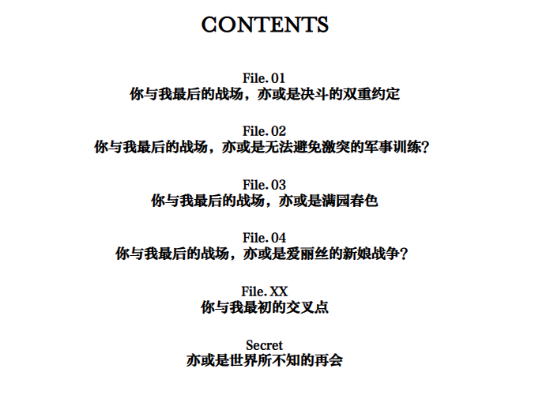

# 高级段落

## ruby 标注


```html
<p>「我和烬还有音音都不太擅长严格的<ruby>小队行动<rt>Team Play</rt></ruby>，但蜜思米丝队长不同。队长在严守纪律的同时还会相信队员的判断」</p>
```

可以对ruby元素进行CSS预设美化。


## 特定文字范围底下加圆点强调


```html
<p>「<span class="em">你错了</span>」</p>
```

可以对em元素进行美化。


## 页面脚注


```html
<p >
「唉！？啊哈哈……才，才没那回事呢。就算是我也记得因为任务而到过的地方啦。哎呀真让人怀念呢。这个施瓦茨平原」
<a  epub:type="noteref" id="fn-01-ref" href="#fn-01" class="fn-ref duokan-footnote">
	
</a>
</p>
```

注意a标签中的id和href：

- id表示自身id，为`fn-01-ref`；
- 而href值表示跳转到脚注的元素。这里脚注元素的id为`fn-01` 。

上面的例子中，脚注标注的是一整行，如果要精准的话，应该只标注**施瓦茨**。不过问题不大。


```html
<div class="footer">
    <div class="spr-footnotes"></div>
    <ol epub:type="footnotes" class="footnotes">
        <li epub:type="footnote" class="aside footnote" id="fn-01">
            <a epub:type="backlink" href="#fn-01-ref">注01</a>
            施瓦茨=Schwarz为德语黑色之意
        </li>
        ...
    </ol>
</div>
```

- spr-footnotes 表示一个横线，作为视觉分割装饰。
- footnotes、footnote、backlink顾名思义，就能知道作用。

脚注这里可以CSS美化，尤其需要注意【注】这个字的样式，上面使用的是图片，其实可以使用CSS类的content属性或者文本。

主要考虑点是在于：不能要求小说创作者会写html。小说创作时，更可能的场景是这样的：

```
Here is a simple footnote[^1]. With some additional text after it.

[^1]: My reference.
```

Here is **a** simple footnote[^1]. With some additional text after it.

[^1]: My reference.

---

框架要做的就是`[^1]` => HTML/CSS的转化与映射。

注意：注的标号需要全局唯一。例如：注1，2，3，4，……。


## 霓虹文字


下面的文字模仿的是插图中的文字。我们这里不关注文字的内容，而是关注效果的实现。

CSS 3的text-shadow显然可以实现这种效果。

```html
<div class="section">
    <div class="section Empire">
        <p class="name">帝国</p>
        <p class="def">机械装置的理想乡</p>
        <p class="eng">Empire</p>
        <p class="desc">拥有高度的科学力与强大的军事力，世界第一的大国。对使用星灵的皇厅感到了威胁，想要将其毁灭。</p>
    </div>

    <div class="section Imperial">
        <p class="name">皇厅</p>
        <p class="def">魔女们的乐园</p>
        <p class="eng">Imperial Household Agency</p>
        <p class="desc">使用『星灵』这一尚未解明的能量来引出超常力量的，魔女们的国度。憎恨迫害着她们的帝国。</p>
    </div>
</div>
```

这里霓虹文字的CSS样式可以泛化，带有剑与魔法风格的轻小说很有可能可以使用这种主题风格的文字描述。

```css
.color-page .Iska, .color-page .Empire {
    text-shadow: 0 0 3px deepskyblue;
    text-shadow: 0 0 0.3em deepskyblue, 0.15em 0 0.3em deepskyblue, 0 0.15em 0.3em deepskyblue, -0.15em 0 0.3em deepskyblue, 0 -0.15em 0.3em deepskyblue;
}

.color-page .Aliceliese, .color-page .Imperial {
    text-shadow: 0 0 3px deeppink;
    text-shadow: 0 0 0.3em deeppink, 0.15em 0 0.3em deeppink, 0 0.15em 0.3em deeppink, -0.15em 0 0.3em deeppink, 0 -0.15em 0.3em deeppink;
}
```

> 小插曲：chrome默认设置了一个text-shadow样式，还添加!important权重。需要disable这行规则，否则上面效果不会生效。
>
> 但是，暂时没有找到永久禁用这个rule的方法。
>
> ```css
> * {
>     text-shadow: transparent 0px 0px 0px, rgb(0 0 0 / 70%) 0px 0px 0px !important;
> }
> ```


## text-box

> [細音啓].你与我最后的战场，亦或是世界起始的圣战.Secret File.epub illus002-i.xhtml


```html
<span class="text-box">「爱丽丝大人，请放弃吧。」</span>
```

```css
.text-box{
    background-color: black;
    color: white;
}
```


## new-toc style

>[細音啓].你与我最后的战场，亦或是世界起始的圣战.Secret File.epub contents-i.xhtml

| 原图                                                         | 模仿                                                         |
| ------------------------------------------------------------ | ------------------------------------------------------------ |
|  |  |

这里原作的布局是两列布局，可以使用columns列布局或者grid布局。右侧例子中，没有按照原作风格进行还原，而是直接1列。

这个TOC布局还是很美观的，可以稍微尝试实现它，然后抽取为一个目录主题CSS。

