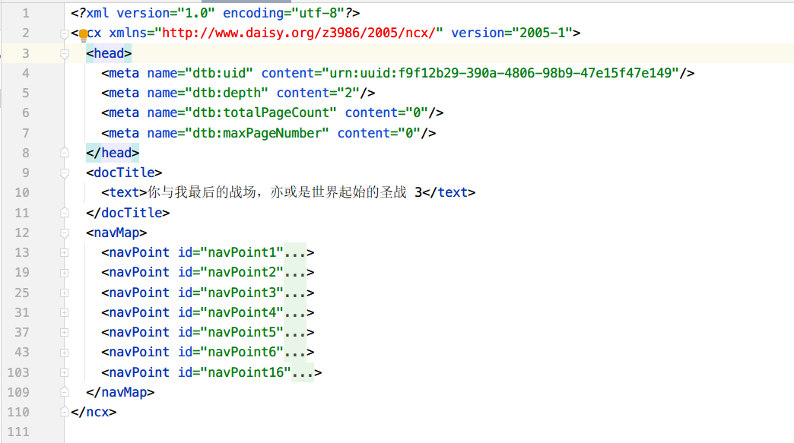

# reverse engineering

## html to markdown

html2md 是为了模拟和还原小说创作者 / 翻译者的写作环境。

流程推导：

```
      split                                                     merge
html ======> [novel template] + [novel md data & user setting] ======> final epub
```

这里，主要关注 split 这一步，merge 不在本文范围。


### extract novel template

非常直接的思路：只要将 epub 中只与模版有关的文本部分抽离出来，复制到独立文件夹。

```
META-INF/         // 元数据 => 保留
  container.xml
OEBPS/
  Fonts/         // 字体文件夹 => 保留
    ...
  Images/        // 插图文件夹 => 移除
    ...
  Styles/        // CSS 样式文件夹 => 保留
    ...
  Text/          // 文档文件夹，抽泣样板 => 修改
    ...
  content.opf    // 非常重要的元数据定义文件 => 修改
  toc.ncx        // epub2 导航兼容 => 修改
mimetype         // 类型 => 保留
```

一共有三处需要修改：

- Text/
- content.opf
- toc.ncx


tox.ncx

```xml
  <spine toc="ncx">
    <itemref idref="cover.xhtml" properties="duokan-page-fullscreen"/>
    <itemref idref="title_page.xhtml"/>
    <itemref idref="information-01.xhtml"/>
    <itemref idref="information-02.xhtml"/>
    <itemref idref="introduction.xhtml"/>
    <itemref idref="color_page-01.xhtml"/>
    <itemref idref="color_page-02.xhtml"/>
    <itemref idref="contents.xhtml"/>
    <itemref idref="nav.xhtml"/>
    <itemref idref="flyleaf.xhtml"/>
    <itemref idref="chapter-01.xhtml"/>
    <itemref idref="chapter-02.xhtml"/>
    <itemref idref="chapter-03.xhtml"/>
    <itemref idref="chapter-04.xhtml"/>
    <itemref idref="chapter-05.xhtml"/>
    <itemref idref="chapter-06.xhtml"/>
    <itemref idref="chapter-07.xhtml"/>
    <itemref idref="chapter-08.xhtml"/>
    <itemref idref="chapter-09.xhtml"/>
    <itemref idref="foreshow.xhtml"/>
  </spine>
```

梳理要制作成模板的书籍结构页。

以 cover 页面为例，模板样例如下：

```html
<?xml version="1.0" encoding="utf-8"?>
<!DOCTYPE html>

<html xmlns="http://www.w3.org/1999/xhtml" xmlns:epub="http://www.idpf.org/2007/ops" lang="zh-CN" xml:lang="zh-CN">
<head>
  <meta charset="utf-8"/>
  <title>Cover</title>
  <link href="../Styles/base.css" type="text/css" rel="stylesheet"/>
  <link href="../Styles/utilities.css" type="text/css" rel="Stylesheet"/>
  <link href="../Styles/structural/cover.css" type="text/css" rel="Stylesheet"/>
  <link href="../Styles/{{BOOK_CSS}}" type="text/css" rel="Stylesheet"/>
  <link href="../Styles/{{BOOK_VOLUME_CSS}}" type="text/css" rel="Stylesheet"/>
</head>

<body epub:type="cover">
<div epub:type="cover" class="section cover">
  <div epub:type="figure" class="illus">
    <!--API: cover image replacement-->
    
  </div>
</div>
</body>
</html>
```
预设 HTML，标记 {{VAR_NAME}}，方便后续替代。


### extract novel md data

技术选型。

- [x] pandoc
- [ ] markdownify
- [] [html-to-markdown-cli](https://github.com/jaywcjlove/html-to-markdown-cli)

use pandoc:

To convert `hello.html` from HTML to Markdown:

```bash
pandoc -f html -i in.html -o out.md
```
### 解除疑惑：nav.xhtml + toc.ncx + spine

- nav.xhtml: 正文中的目录页面。它是一个页面。
- tox.ncx: epub2 规范下的导航信息点定义。可以视为过时，但是依旧广泛使用者。
- spine in content.opf: 定义全书的内容顺序，一个一个文档 xhtml 的摆放顺序，自上而下。

### content.opf
metadata:
```xml
  <metadata xmlns:dc="http://purl.org/dc/elements/1.1/">
    <!-- 标题 -->
    <dc:title id="tle"> 你与我最后的战场，亦或是世界起始的圣战 3</dc:title>
    <!-- 标题类型：主标题 -->
    <meta property="title-type" refines="#tle">main</meta>
    <!-- 归档名称 -->
    <meta property="file-as" refines="#tle"> 你与我最后的战场，亦或是世界起始的圣战 03</meta>
    <!-- 可选脚本：可选语言：日语 -->
    <meta property="alternate-script" xml:lang="ja" refines="#tle"> キミと僕の最後の戦場、あるいは世界が始まる聖戦 3</meta>

    <!-- 属于某个作品集：你与我最后的战场，亦或是世界起始的圣战 -->
    <meta property="belongs-to-collection" id="num"> 你与我最后的战场，亦或是世界起始的圣战 </meta>
    <!-- 作品集类型：一系列 -->
    <meta property="collection-type" refines="#num">series</meta>
    <!-- 系列 3，这里实际含义是卷 3-->
    <meta property="group-position" refines="#num">3</meta>
    <!-- 可选脚本：可选语言：日语 -->
    <meta property="alternate-script" xml:lang="ja" refines="#num"> キミと僕の最後の戦場、あるいは世界が始まる聖戦 </meta>

    <!-- 作者名 -->
    <dc:creator id="cre"> 細音啓 </dc:creator>
    <!-- 归档名称 -->
    <meta property="file-as" refines="#cre"> 細音啓 </meta>
    <!-- 可选脚本：可选语言：简体中文 -->
    <meta property="alternate-script" xml:lang="zh-CN" refines="#cre"> 细音启 </meta>

    <!-- 贡献者：插画师 -->
    <dc:contributor id="ill"> 猫鍋蒼 </dc:contributor>
    <!-- 相关角色，角色: 插画 -->
    <meta scheme="marc:relators" property="role" refines="#ill">ill</meta>
    <!-- 归档为：画师名称 -->
    <meta property="file-as" refines="#ill"> 猫鍋蒼 </meta>
    <!-- 可选脚本：简体中文：画师名称 -->
    <meta property="alternate-script" xml:lang="zh-CN" refines="#ill"> 猫锅苍 </meta>

    <!-- 翻译者 trl-->
    <dc:contributor id="trl"> 天灾 </dc:contributor>
    <meta scheme="marc:relators" property="role" refines="#trl">trl</meta>
    <!-- 编剧 red-->
    <dc:contributor id="red"> 轻亦之间 </dc:contributor>
    <meta scheme="marc:relators" property="role" refines="#red">red</meta>
    <!-- 制片人 pro-->
    <dc:contributor id="pro"> 第九〇七部队 </dc:contributor>
    <meta scheme="marc:relators" property="role" refines="#pro">pro</meta>

    <dc:description> 皇庁への潜入、大罪人の脱獄。魔女と剣士の運命は激化する――
      「キミだから譲れないの」「僕からも大事な話がある」皇庁への潜入を命じられた矢先、イスカはアリスの監視下に置かれる事態に見舞われる。超至近距離で互いの心を垣間見る二人だが、皇庁を揺るがす事件が起きて……
    </dc:description>
    <dc:publisher> 轻之国度 ePub 工作组 </dc:publisher>
    <dc:source> 轻之国度 www.lightnovel.cn</dc:source>
    <dc:subject> 轻小说 </dc:subject>
    <dc:language>zh-CN</dc:language>
    <dc:date>2017-12-20</dc:date>
    <dc:identifier id="BookId">urn:uuid:f9f12b29-390a-4806-98b9-47e15f47e149</dc:identifier>

    <meta name="Sigil version" content="0.9.10"/>
    <meta name="ePub version" content="2.0.0"/>
    <meta property="dcterms:modified">2019-05-26T16:27:23Z</meta>

  </metadata>
```
这样形式是对相应 ID 的补充说明信息，也就是 refine：
```xml
<meta property="title-type" refines="#tle">main</meta>
```
这种 metadata 形式不建议使用 template 预设法，而是应该完全由代码脚本来生成。 `marc:relators` 的角色枚举太多，写成文本模板非常低效。

---
manifest
```xml
 <manifest>
    <item id="ncx" href="toc.ncx" media-type="application/x-dtbncx+xml"/>
    <item id="cover.xhtml" href="Text/cover.xhtml" media-type="application/xhtml+xml"/>
    <item id="nav.xhtml" href="Text/nav.xhtml" media-type="application/xhtml+xml" properties="nav"/>
    <item id="information-02.xhtml" href="Text/information-02.xhtml" media-type="application/xhtml+xml"/>
    <item id="title_page.xhtml" href="Text/title_page.xhtml" media-type="application/xhtml+xml"/>
    <item id="information-01.xhtml" href="Text/information-01.xhtml" media-type="application/xhtml+xml"/>
    <item id="introduction.xhtml" href="Text/introduction.xhtml" media-type="application/xhtml+xml"/>
    <item id="color_page-01.xhtml" href="Text/color_page-01.xhtml" media-type="application/xhtml+xml"/>
    <item id="color_page-02.xhtml" href="Text/color_page-02.xhtml" media-type="application/xhtml+xml"/>
    <item id="contents.xhtml" href="Text/contents.xhtml" media-type="application/xhtml+xml"/>
    <item id="aut.ttf" href="Fonts/aut.ttf" media-type="application/x-font-ttf"/>
    <item id="fn-ref.png" href="Images/fn-ref.png" media-type="image/png"/>
    <item id="ill.ttf" href="Fonts/ill.ttf" media-type="application/x-font-ttf"/>
    <item id="LK-logo.png" href="Images/LK-logo.png" media-type="image/png"/>
    <item id="maker.ttf" href="Fonts/maker.ttf" media-type="application/x-font-ttf"/>
    <item id="order.ttf" href="Fonts/order.ttf" media-type="application/x-font-ttf"/>
    <item id="title.ttf" href="Fonts/title.ttf" media-type="application/x-font-ttf"/>
    <item id="title-hei.ttf" href="Fonts/title-hei.ttf" media-type="application/x-font-ttf"/>
    <item id="team.ttf" href="Fonts/team.ttf" media-type="application/x-font-ttf"/>
    <item id="x000-TL2-01_FRM.css" href="Styles/000-TL2-01_FRM.css" media-type="text/css"/>
    <item id="x000-TL2-02_STD.css" href="Styles/000-TL2-02_STD.css" media-type="text/css"/>
    <item id="x000-TL2-03_ADV.css" href="Styles/000-TL2-03_ADV.css" media-type="text/css"/>
    <item id="x000-TL2-04_SIG.css" href="Styles/000-TL2-04_SIG.css" media-type="text/css"/>
    <item id="x000-TL2-05_TMP.css" href="Styles/000-TL2-05_TMP.css" media-type="text/css"/>
    <item id="x021-WEWRW-03.css" href="Styles/021-WEWRW-03.css" media-type="text/css"/>
    <item id="x021-WEWRW-00.css" href="Styles/021-WEWRW-00.css" media-type="text/css"/>
    <item id="color-01.jpg" href="Images/color-01.jpg" media-type="image/jpeg"/>
    <item id="color-02.jpg" href="Images/color-02.jpg" media-type="image/jpeg"/>
    <item id="contents.jpg" href="Images/contents.jpg" media-type="image/jpeg"/>
    <item id="cover.jpg" href="Images/cover.jpg" media-type="image/jpeg"/>
    <item id="flyleaf.jpg" href="Images/flyleaf.jpg" media-type="image/jpeg"/>
    <item id="foreshow.jpg" href="Images/foreshow.jpg" media-type="image/jpeg"/>
    <item id="illus-01.jpg" href="Images/illus-01.jpg" media-type="image/jpeg"/>
    <item id="illus-02.jpg" href="Images/illus-02.jpg" media-type="image/jpeg"/>
    <item id="illus-03.jpg" href="Images/illus-03.jpg" media-type="image/jpeg"/>
    <item id="illus-04.jpg" href="Images/illus-04.jpg" media-type="image/jpeg"/>
    <item id="illus-05.jpg" href="Images/illus-05.jpg" media-type="image/jpeg"/>
    <item id="illus-06.jpg" href="Images/illus-06.jpg" media-type="image/jpeg"/>
    <item id="foreshow.xhtml" href="Text/foreshow.xhtml" media-type="application/xhtml+xml"/>
    <item id="flyleaf.xhtml" href="Text/flyleaf.xhtml" media-type="application/xhtml+xml"/>
    <item id="chapter-01.xhtml" href="Text/chapter-01.xhtml" media-type="application/xhtml+xml"/>
    <item id="chapter-02.xhtml" href="Text/chapter-02.xhtml" media-type="application/xhtml+xml"/>
    <item id="chapter-03.xhtml" href="Text/chapter-03.xhtml" media-type="application/xhtml+xml"/>
    <item id="chapter-04.xhtml" href="Text/chapter-04.xhtml" media-type="application/xhtml+xml"/>
    <item id="chapter-05.xhtml" href="Text/chapter-05.xhtml" media-type="application/xhtml+xml"/>
    <item id="chapter-06.xhtml" href="Text/chapter-06.xhtml" media-type="application/xhtml+xml"/>
    <item id="chapter-07.xhtml" href="Text/chapter-07.xhtml" media-type="application/xhtml+xml"/>
    <item id="chapter-08.xhtml" href="Text/chapter-08.xhtml" media-type="application/xhtml+xml"/>
    <item id="chapter-09.xhtml" href="Text/chapter-09.xhtml" media-type="application/xhtml+xml"/>
    <item id="flyleaf-eng.ttf" href="Fonts/flyleaf-eng.ttf" media-type="application/x-font-ttf"/>
    <item id="contents.ttf" href="Fonts/contents.ttf" media-type="application/x-font-ttf"/>
  </manifest>
```
每一个 item 都含有三个属性：id、href、media-type。利用代码 for-loop 即可。

---

```xml
  <spine toc="ncx">
    <itemref idref="cover.xhtml" properties="duokan-page-fullscreen"/>
    <itemref idref="title_page.xhtml"/>
    <itemref idref="information-01.xhtml"/>
    <itemref idref="information-02.xhtml"/>
    <itemref idref="introduction.xhtml"/>
    <itemref idref="color_page-01.xhtml"/>
    <itemref idref="color_page-02.xhtml"/>
    <itemref idref="contents.xhtml"/>
    <itemref idref="nav.xhtml"/>
    <itemref idref="flyleaf.xhtml"/>
    <itemref idref="chapter-01.xhtml"/>
    <itemref idref="chapter-02.xhtml"/>
    <itemref idref="chapter-03.xhtml"/>
    <itemref idref="chapter-04.xhtml"/>
    <itemref idref="chapter-05.xhtml"/>
    <itemref idref="chapter-06.xhtml"/>
    <itemref idref="chapter-07.xhtml"/>
    <itemref idref="chapter-08.xhtml"/>
    <itemref idref="chapter-09.xhtml"/>
    <itemref idref="foreshow.xhtml"/>
  </spine>
```
定义文档顺序。由制作者指定。数据结构就是个数组。

--

```xml
  <guide>
    <reference type="toc" title="目录" href="Text/nav.xhtml"/>
    <reference type="cover" title="封面" href="Text/cover.xhtml"/>
    <reference type="title-page" title="标题页" href="Text/title_page.xhtml"/>
    <reference type="other.introduction" title="" href="Text/introduction.xhtml"/>
  </guide>
```
指南元素。这个元素不是必须的，起引导作用。一般都是定义目录页、封面页、标题页、简介页。

### toc.ncx



这里也没有需要特别注意的地方。使用代码直接面向对象编程，然后新建对象，设置属性，写到文件……。


## references

- https://github.com/marisademeglio/eleventypub
